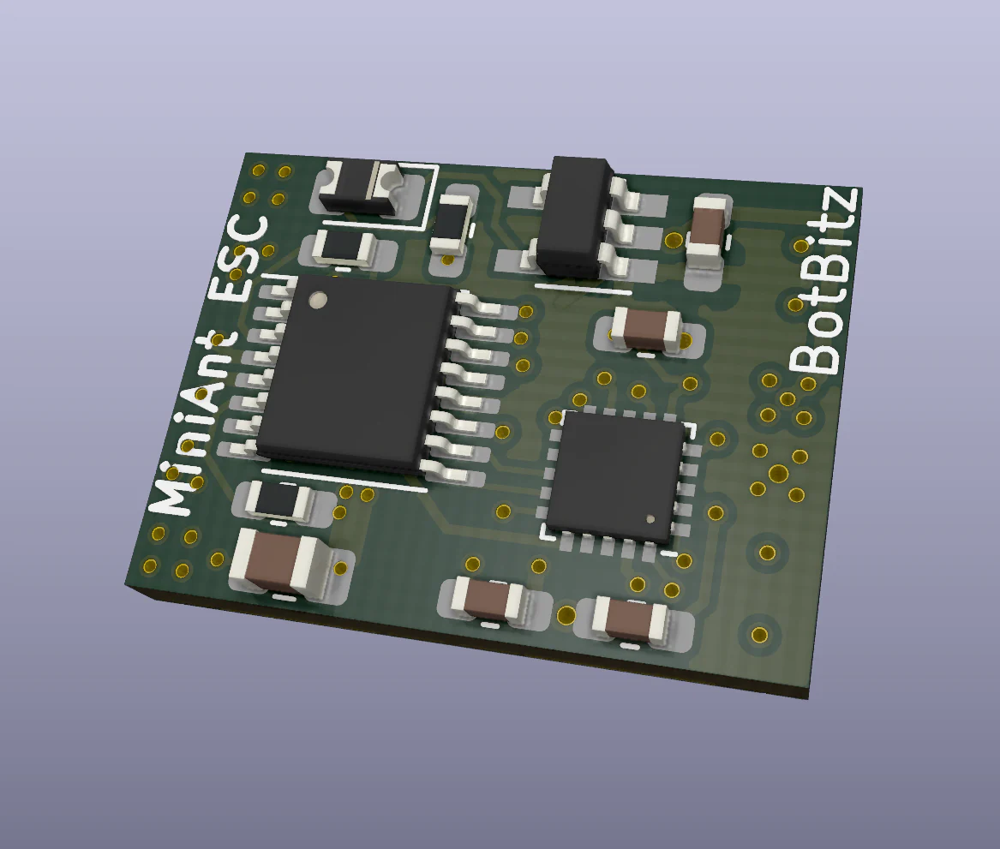
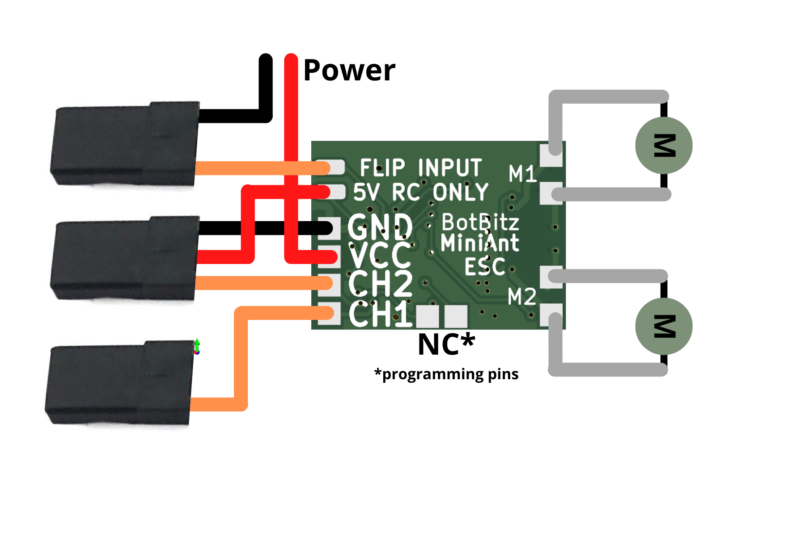

# 

# MiniAnt ESC

  

The MiniAnt ESC was designed to minimise wiring and configuration needed for the 150gram antweight combat robot class. It is a small lightweight, two channel (2CH) motor controller designed to run N20 style motors. Inspired by the DFRobot motor mounted ESC, this 2CH version incorporates some additional features that make it easier for use in a your RC robots. 

## Specifications

- **Voltage**: 1 - 3S  (3.3V to 13V)
- **Current**: 2 Channels @ 1A continuous with current limiting
- **Input**: 1-2ms PWM signals
- **Weight:** 5g (without leads)
- **BEC**: 5v 100ma LDO BEC (suitable for RX use ONLY! more details below) 

#### Features

- **Mixing** 
- **Flip Input**
- **Compact Design**
- **Exponential rates**

The MiniAnt ESC comes pre-configured with mixing enable and RC leads soldered.  Flip input, programming, exponential rates and the BEC can be utilised by soldering additional wires to the base of the ESC as detailed below. 

## Wiring

#### Simple Wiring

The MiniESC can simply be plugged into an RX and powered via the RC lines. This is the simplest and easiest way to get started. 

*Note - **BOTH*** CH1 and CH2 must be plugged in otherwise the ESC will not move either motor. 

#### 

#### Advanced wiring

The ESC can be wired in a variety of configurations for additional features. Below is an example of the ESC configured for flip input, external power in and 5V BEC power for receiver. 

*Note - If you do not wish to use the flip input alternatively an additional wire can be added to the GND to connect to power. 

##### 5V BEC Usage

For convenience the 5V regulator for the ESC has been made accessible. This can output a maximum of 50ma at 3S this is enough to run most RC receivers but should *NOT* be used for servos or any other actuators. 

##### LED Flash Debugging

- Solid on - No valid movement signals received
- 0.5Hz Flashing - ESC active - Braking
- 2Hz Flashing - Motors moving
- 5Hz Flashing - Flip mode on

## Programming

Programming mode allows you to disable or enable the mixing and exponential modes. 

By default:

- **Mixing**: Enabled
- **Exponential**: Disabled

#### Entering Programming Mode

Entering programming mode requires a number of conditions to be met:

- ESC must have just been powered on
- CH1 and CH2 must be centred and receiving valid signals. (The LED should stay solid)
- CH3 should move - Down - Up - Down - Up
- LED will start flashing fast (We are now in programming mode)
- Move stick to middle (Will start outputting current settings)

This sequence ensures that you don't accidentally end up in programming mode when you are battling. It will also exit programming mode as soon as there is movement signals (not centred) on CH1 and CH2. So if you do somehow enter programming mode in battle as soon as you try to drive it will exit and resume normal operation. 

#### Reading Current Settings

With the ESC in the middle it will output the current settings state. Wait for at least two loops to confirm settings. As you may enter the loop at any time point. Examples of setting states are below. 

- 1 Flash = Off

- 2 Flash = On

- The settings will flash: Mixing, Expo followed by long off period. 

  

#### Changing Settings

To change settings simply move the stick up or down and return to middle. Moving up toggles mixing, moving down toggles expo. Once toggled check the flashing pattern to confirm. 

#### Saving Settings

Settings are saved as soon as they are changed. All you need to do is exit programming mode. This can be done by power cycling. 

## Flip Input

Flip input works by flipping the output directions for back and forward. This will work with both mixing on the transmitter or on the ESC. 

To enable simple connect the FLIP input line to an channel on the receiver. When the signal is greater 1600ms the flip function is enabled. 

When using the flip input the polarity in which the motors are soldered matters. We suggest testing the function and mixing setup prior to assembly. If when you enable FLIP function the direction the robot turns is flipped instead you need to reverse one of the motor directions. FLIP should only swap motor direction back and forwards. This is true for both mixing on the ESC and on the radio. 

## Additional Resources

#### ESC 3D Model

We have a full 3D model of our ESC to allow you to embed this in your robot designs. Just make sure to remember where the wires have to run as these are not included. 

#### ESC Motor soldering jig

It is important to have the motors aligned correctly when soldering them to the ESC if you wish to use it without motor wires. This jig will help you solder your motor leads straight and hold everything in its correct place. 

#### MiniAnt Robot 

We also designed a small robot to help us test our ESC. If you wish to print it the design files are available here. 

